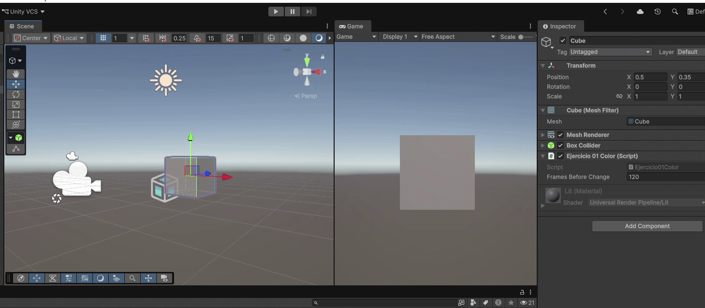
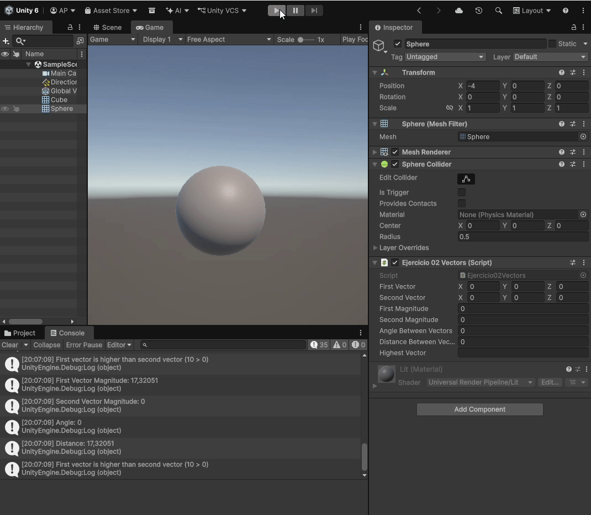

# Práctica 01. Introducción C# - Scripts.

## Índice

## Introducción

Este informe recoge el desarrollo de la Primera Práctica de la asignatura Interfaces Inteligentes, la cuál supone una primera toma de contacto con el entorno de desarrollo de Unity, la gestión de escenas 3D y la prgramación de componentes mediante *scripts* en C#.

Para llevara  cabo la implementación de las diferentes funcionalidades, ha sido necesario visitar el [Manual de Unity](https://docs.unity3d.com/Manual/index.html) en numerosas ocasiones. Gracias a ello he podido comprender el comportamiento de clases como `Vector3`, la localización de objetos en escena mediante etiquetas y la gestión de elementos de interfaz de usuario (con clases como `TextMeshPro`).

## Ejercicio 01. Colores.

El fichero con el código se encuentra en [Scripts/Ejercicio01Color.cs](Scripts/Ejercicio01Color.cs)

### Descripción
En este primer ejercicio se buscaba cambiar el color de un cubo de forma periódica (tras un intervalo de frames que podían ser introducidos por el usuario a través del inspector).

### Implementación
Para realizar este ejercicio tuve que aprender tres ideas:
- Gracias al método `Update()` pude llevar un recuento de los frames para que, cada N frames, se pudiera realizar el cambio de color. Para controlar la variable que contaba el número de frames lo que hice fue igualarla a 0 cada vez que cambiaba el color y usé la condición `>=` en vez de `==` para controlar los casos en que el usuario cambia el número máximo de frames durante la ejecución.

- El componente `Renderer` es el que permite, a través de la propiedad `material.color` cambiar el color del objeto.

- C# cuenta con una clase Random que permite, utilizando `Random.Range`, generar números aleatorios tanto enteros como de punto flotante. Esto fue esencial para generar, tanto la nueva posición del color a modificar como e nuevo valor a introducir para generar el color.

### Ejecución
A continuación se muestra, en una imagen GIF, el resultado del ejercicio:

## Ejercicio 02. Vectores
El fichero con el código se encuentra en [Scripts/Ejercicio02Vectors.cs](Scripts/Ejercicio02Vectors.cs)

### Descripción
El objetivo de este ejercicio fue aplicar operaciones de vectores en Unity utilizando la clase `Vector3`. Para ello, se debían colocar dos vectores en el inspecto y, a partir de sus coordenadas, se mostró la magnitud, el ángulo que formaban, la distancia que los separaba y cuál estaba a mayor altura. 

### Implementación
- La realización de los cálculos fue bastante sencilla gracias a las múltiples facilidades que aporta la clase [Vector3](https://docs.unity3d.com/ScriptReference/Vector3.html). Fueron necesarios métodos como `Vector3.Angle()`, `Vetor3.Distance()` y los atributos `.magnitude` y `.y`.

- Además, aunque no se pidiera expresamente, para no saturar la terminal con mensajes en cada frame, el script almacena el estado de los vectores en el frame anterior. De esta manera, se puede usar un `return` temprano que evite mostrar mensajes cuando los datos de entrada no han cambiado.

### Ejecución

