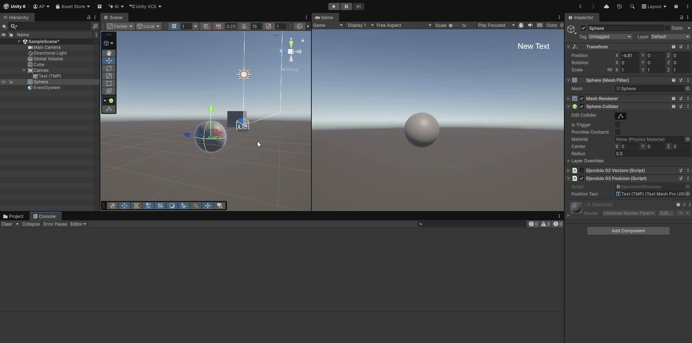
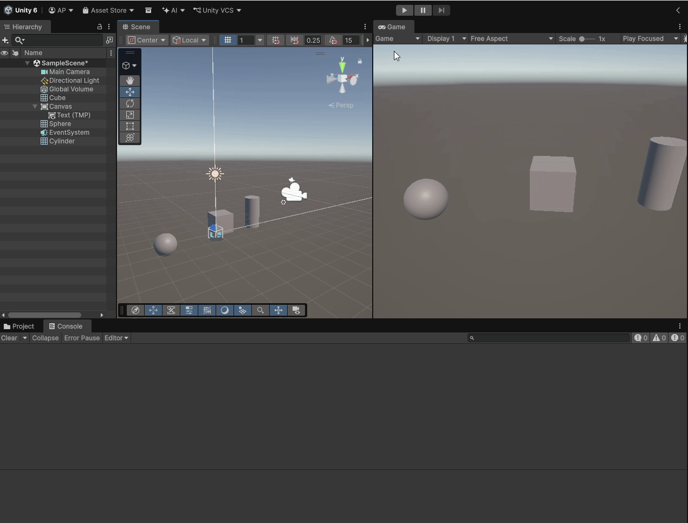

# Práctica 01. Introducción C# - Scripts.

## Índice
* [Introducción](#introducción)
* [Ejercicio 01. Colores](#ejercicio-01-colores)
* [Ejercicio 02. Vectores](#ejercicio-02-vectores)
* [Ejercicio 03. Texto en Pantalla](#ejercicio-03-texto-en-pantalla)
* [Ejercicio 04. Distancia entre Cubo y Cilindro](#ejercicio-04-distancia-entre-cubo-y-cilindro)

## Introducción

Este informe recoge el desarrollo de la Primera Práctica de la asignatura Interfaces Inteligentes, la cuál supone una primera toma de contacto con el entorno de desarrollo de Unity, la gestión de escenas 3D y la prgramación de componentes mediante *scripts* en C#.

Para llevara  cabo la implementación de las diferentes funcionalidades, ha sido necesario visitar el [Manual de Unity](https://docs.unity3d.com/Manual/index.html) en numerosas ocasiones. Gracias a ello he podido comprender el comportamiento de clases como `Vector3`, la localización de objetos en escena mediante etiquetas y la gestión de elementos de interfaz de usuario (con clases como `TextMeshPro`).

## Ejercicio 01. Colores.

El fichero con el código se encuentra en [Scripts/Ejercicio01Color.cs](Scripts/Ejercicio01Color.cs)

### Descripción
En este primer ejercicio se buscaba cambiar el color de un cubo de forma periódica (tras un intervalo de frames que podían ser introducidos por el usuario a través del inspector).

### Implementación
Para realizar este ejercicio tuve que aprender tres ideas:
- Gracias al método `Update()` pude llevar un recuento de los frames para que, cada N frames, se pudiera realizar el cambio de color. Para controlar la variable que contaba el número de frames lo que hice fue igualarla a 0 cada vez que cambiaba el color y usé la condición `>=` en vez de `==` para controlar los casos en que el usuario cambia el número máximo de frames durante la ejecución.

- El componente `Renderer` es el que permite, a través de la propiedad `material.color` cambiar el color del objeto.

- C# cuenta con una clase Random que permite, utilizando `Random.Range`, generar números aleatorios tanto enteros como de punto flotante. Esto fue esencial para generar, tanto la nueva posición del color a modificar como el nuevo valor a introducir para generar el color.

### Ejecución

## Ejercicio 02. Vectores
El fichero con el código se encuentra en [Scripts/Ejercicio02Vectors.cs](Scripts/Ejercicio02Vectors.cs)

### Descripción
El objetivo de este ejercicio fue aplicar operaciones de vectores en Unity utilizando la clase `Vector3`. Para ello, se debían colocar dos vectores en el inspector y, a partir de sus coordenadas, se mostró la magnitud, el ángulo que formaban, la distancia que los separaba y cuál estaba a mayor altura. 

### Implementación
- La realización de los cálculos fue bastante sencilla gracias a las múltiples facilidades que aporta la clase [Vector3](https://docs.unity3d.com/ScriptReference/Vector3.html). Fueron necesarios métodos como `Vector3.Angle()`, `Vetor3.Distance()` y los atributos `.magnitude` y `.y`.

- Además, aunque no se pidiera expresamente, para no saturar la terminal con mensajes en cada frame, el script almacena el estado de los vectores en el frame anterior. De esta manera, se puede usar un `return` temprano que evite mostrar mensajes cuando los datos de entrada no han cambiado.

### Ejecución

## Ejercicio 03. Texto en Pantalla
El fichero con el código se encuentra en [Scripts/Ejercicio03Posicion.cs](Scripts/Ejercicio03Posicion.cs)

### Descripción

En este ejercicio, el objetivo era integrar elementos de interfaz gráfica de usuario en la escena 3D para transmitir información del estado de juego en pantalla. En concreto, la idea era proyectar las coordenadas tridimensionales de la esfera en tiempo real según se iba desplazando por el espacio.

### Implementación
En este caso tuve que buscar algo más de información acerca de Canvas y de cómo mostrar texto que se viera en la cámara.

- Para ello tuve que crear en la jerarquía un objetos `Canvas` que tenía como hijo un componente de texto llamado `TextMeshProUGUI`. Este elemento de texto es el que recoge el script para actualizarlo y mostrar el contenido deseado.

- En el script, se cogen las coordenadas (en forma de `Vector3`) de la esfera y se pasan a cadena de texto (con el método `ToString()`). Este texto se pone en el atributo `.text` del componente de texto, para que se actualice y muestre en pantalla las coordenadas en tiempo real.

- En este caso fue necesario comprobar que el componente de texto no fuera nulo para evitar excepciones. Además, se tuvo que desactivar el wrapping para que el texto no se dividiera en filas.

### Ejecución

## Ejercicio 04. Distancia entre Cubo y Cilindro

El fichero con el código se encuentra en [Scripts/Ejercicio04DistanciaCuboCilindro.cs](Scripts/Ejercicio04DistanciaCuboCilindro.cs)

### Descripción
En este último ejercicio se pedía implementar la localización dinámica de objetos mediante el sistema de etiquetas de Unity. A partir de la esfera, que tenía al script como componente, se debían obtener las referencias al Cubo y al Cilindro para obtener sus coordenadas y calcular la distancia entre uno y otro.

### Implementación
- En primer lugar, fue necesario crear tags (en mi caso se llamaron `Colored Cube` y `Grey-Cylinder`) y asignarlos en el inspector a los respectivos objetos. Esto permitió utilizar el método `GameObject.FindWithTag()` en el script durante la fase de inicialización.

- En cada frame, se leyeron las propiedades `.position` actualizadas y gracias al método `Vector3.Distance()` se pudo determinar la distancia entre el Cubo y el Cilindro.

- Además, para no saturar la terminal, como ya hicimos en un ejercicio anterior, se almacena la posición anterior de ambos objetos esperando a que cambien para volver a realizar el cálculo de la distancia.

### Ejecución

